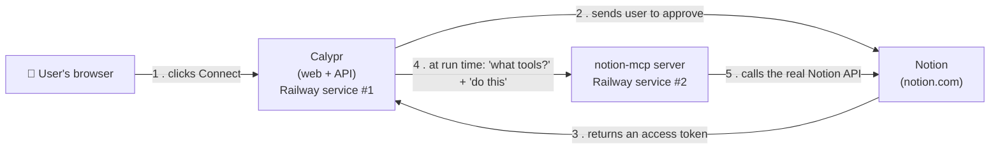

# MCP in production — the plain-English version

A companion to `infra/CONNECTORS.md`. That file is the reference; this one explains *why* the
pieces exist, so the setup makes sense when you come back to it in three months.

---

## 1. What MCP actually is

**MCP (Model Context Protocol) is a standard plug shape.**

Before it, every AI product wrote custom glue for every app it wanted to reach: some code for
Notion, different code for Slack, different code again for GitHub. MCP replaces that with one
socket. A vendor writes an **MCP server** for their product, and any AI app that speaks MCP can
plug in and immediately see a list of available tools — "search pages", "create a page", and so
on — without knowing anything about Notion in particular.

For Calypr that means: **your Tool node doesn't need Notion-specific code.** It connects to
Notion's MCP server, asks "what can you do?", and hands that list to the agent.

> MCP was designed for desktop apps first, where the AI and the MCP server run on the same
> laptop. That heritage explains some of the awkwardness below — see §7.

---

## 2. The four boxes

Connecting Notion involves four things talking to each other:

The part that surprises people is **box 3**. Why does Notion need its own separate server?

Because `notion-mcp-server` is **a program Notion publishes, written in Node.js**. Calypr's
backend is Python. You cannot run someone else's Node program inside your Python process — so it
runs beside it, as its own service, and the two talk over HTTP.

That is the entire reason for the second Railway service. It is not architecture for its own
sake; it is "this is a different program in a different language."

---

## 3. Why Railway, and what "a second service" means

A Railway **project** is a container for **services**. You already have one service: the Calypr
API. Adding the Notion MCP server means adding a second service to that same project.

They are independent programs — separate deploys, separate logs, separate restarts — that can
talk to each other. Think of it as two apps living in the same building.

The repo now includes `infra/notion-mcp/`, which tells Railway how to build that second service:
a `Dockerfile` (the recipe for the container) and a `railway.json` (the settings). You point a
new Railway service at that folder and it builds itself.

---

## 4. The two tokens (this is the confusing part)

There are **two different secrets**, doing two different jobs. Mixing them up is the most common
way this setup breaks.

| Token | Who it identifies | Where it's set | Analogy |
|---|---|---|---|
| **`AUTH_TOKEN`** (a.k.a. `CALYPR_NOTION_MCP_AUTH`) | Calypr itself | Same value on both services | The **key to the building** — proves it's Calypr knocking, not a stranger |
| **Notion bot token** | One specific user's Notion workspace | Never set by hand; created by OAuth, stored encrypted in the vault | The **key to one apartment** — decides whose Notion data you see |

Why both? Because **one MCP server serves every Calypr customer.** The building key stops
randoms on the internet from using your server at all. The apartment key, sent fresh with each
request in a `Notion-Token` header, decides *whose* Notion is being read on that request.

This is why the MCP server runs with `--enable-token-passthrough`: it means "don't use one fixed
Notion account — expect each request to bring its own." Without it you would need a separate
server per customer.

---

## 5. What happens when someone clicks "Connect Notion"

1. Calypr sends the browser to Notion's approval screen, carrying a **`state`** — a signed,
   10-minute ticket that says "this request came from workspace X".
2. The user approves. Notion sends the browser back to
   `https://calypr.co/api/connectors/notion/callback` with a code **and that same state**.
3. Calypr checks the state first. If it's missing, altered, expired, or belongs to a different
   workspace, the request is thrown away before anything else happens.

   *Why:* without it, an attacker could send you a link that quietly connects **their** Notion
   account to **your** workspace — so your agents would read their data, or worse, write yours
   into it. The state is what makes that impossible.
4. Calypr swaps the code for the Notion bot token, encrypts it, and stores it.
5. From then on, whenever an agent runs, Calypr decrypts that token and passes it to the MCP
   server as `Notion-Token`. **The token is never in the canvas, never in generated code, and
   never sent to the browser.**

---

## 6. Setting it up — what each setting is for

On the **notion-mcp service**:

| Setting | Meaning |
|---|---|
| `AUTH_TOKEN` | The building key. Any long random string — `openssl rand -hex 32`. |

On the **API service**:

| Setting | Meaning |
|---|---|
| `CALYPR_NOTION_MCP_URL` | Where the MCP server lives, e.g. `https://notion-mcp-xxx.up.railway.app/mcp` |
| `CALYPR_NOTION_MCP_AUTH` | The **same** value as `AUTH_TOKEN` above |
| `CALYPR_NOTION_CLIENT_ID` / `_SECRET` | From your Notion integration — identifies Calypr to Notion |
| `CALYPR_OAUTH_REDIRECT_BASE` | `https://calypr.co` — where Notion sends users back. No trailing slash. |
| `CALYPR_VAULT_KEY` | Encrypts stored tokens. Already required; must be set. |

**Checking it worked:** open `https://<mcp-service>/mcp` in a browser. A `401 Unauthorized` is
**success** — the door is locked, which is what you want. Anything else (a timeout, a 404) means
the service isn't running or the URL is wrong. Then use Settings → the connector's **Test**
button, which should list ~24 Notion tools.

> **Live setup, as deployed:** service `notion-mcp` in the `calypr-api` Railway project, at
> `https://notion-mcp-production-0383.up.railway.app`. `PORT` is pinned to 8080 so the domain's
> target port can't drift from what the app binds.

**If something breaks**, in the order worth checking:

| Symptom | Almost always means |
|---|---|
| "Notion is not configured on this server" | `CALYPR_NOTION_CLIENT_ID/SECRET` missing on the API service |
| `403 Forbidden` from the MCP server | The two token values don't match |
| `401` on Test, with tokens matching | The Notion bot token expired — reconnect in Settings |
| "invalid or expired" after approving | Took longer than 10 minutes on the consent screen — just retry |
| `Invalid Host header` | Only happens locally. See §7. |

---

## 7. The desktop heritage, and one trap it creates

MCP assumed the AI and the MCP server share a machine, so a class of protections assume
"localhost". One of them causes a genuinely confusing error.

The Notion MCP server has **DNS-rebinding protection** — it refuses requests whose `Host` header
isn't the exact address it's listening on. On a laptop that's a sensible guard. On Railway,
where the port and domain are assigned for you, it looks like a brick wall.

**The resolution: that protection only switches on when the server runs without a password.**
Locally we run it with `--unsafe-disable-auth` (no password, isolated machine), so the guard is
active and the ports must line up exactly. In production we give it `AUTH_TOKEN` instead, and the
guard turns off — because the password is now doing that job.

So: **the port-matching rule you'll read in `CONNECTORS.md` applies only to local development.**
It does not apply on Railway. This was verified by running the server, not assumed.

---

## 8. Two kinds of connector — and why only one of them is web-shaped

Calypr can connect to MCP in two ways, and they suit very different users:

**Tier A — app connectors (Notion, and future OAuth apps).** The user clicks Connect, approves,
done. They never learn what MCP is; it's plumbing. **This is the web-shaped one**, and the one
worth investing in.

**Tier B — "paste your own MCP server URL".** The user supplies an address and a token for a
server they run themselves. This is the **desktop-shaped** one. Most MCP servers people actually
run live on their own laptop, at `localhost` — and Calypr's backend runs in the cloud, so it
simply cannot reach them (and deliberately blocks trying, as an SSRF protection). Tier B is only
usable by someone who has already deployed an MCP server to a public URL, which is a small
slice of users.

Both use the identical machinery underneath. The difference is entirely who can realistically
use them.
